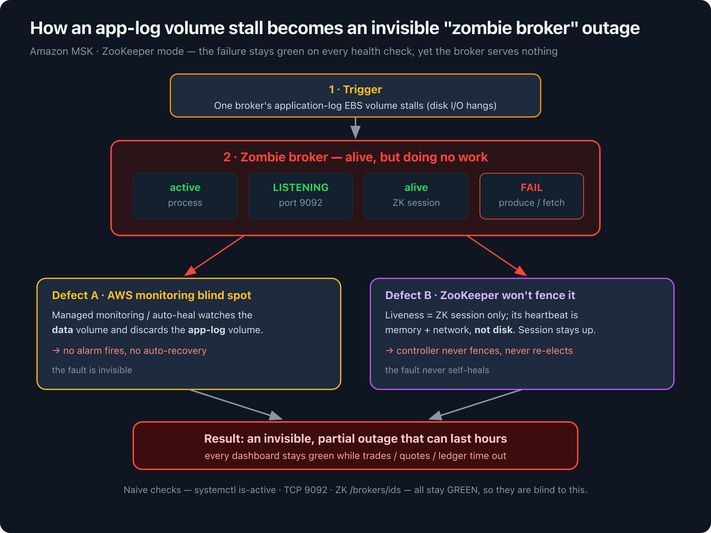
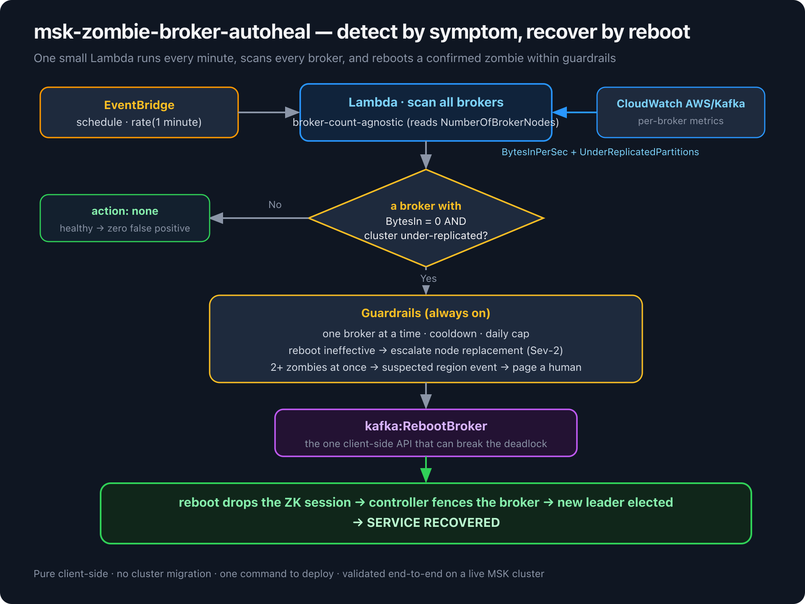

# msk-zombie-broker-autoheal

**English · [中文说明 →](README_CN.md)**

> **One command to detect and auto-recover "zombie brokers" on Amazon MSK (ZooKeeper mode).**
> Closes the app-log volume blind spot that turns a single stalled broker into a multi-hour, *invisible* outage.

[](https://github.com/neosun100/msk-zombie-broker-autoheal/actions/workflows/ci.yml) []() [](docs/POC-REPORT.md) []() []()

> **Validated end-to-end on a real managed Amazon MSK cluster** (Kafka 3.8.x, ZooKeeper, 3 brokers):
> deploy + idempotency, zero false positives, detection on real CloudWatch metrics, an
> autonomous real `kafka:RebootBroker`, real recovery, and the cooldown guardrail — see
> [`docs/POC-REPORT.md`](docs/POC-REPORT.md). The live POC also caught and fixed two bugs that
> would otherwise have made detection silently fail.

> ⚠️ **Disclaimer**: This is sample/reference code provided for demonstration purposes. It calls
> `kafka:RebootBroker` on your cluster — review the IAM policy and logic, deploy with `--observe-only`
> first, and validate in a non-production environment before any production use. Deploy at your own risk.

---

## In plain words (the whole idea in 60 seconds)

- **What goes wrong.** Once in a while a single MSK broker's *log disk* freezes. The broker
  still *looks* perfectly healthy — the process is up, port 9092 is open, its ZooKeeper
  session is alive — so every health check stays green. But it has quietly stopped doing any
  work. It's a **zombie**. AWS's managed monitoring doesn't watch that particular disk, and
  ZooKeeper won't kick the broker out (because its session is still alive), so the outage is
  **invisible and never fixes itself** — it can drag on for hours.

- **How we find it.** We stop trusting the "is it alive?" checks (they're blind here) and
  instead watch the **symptom** that AWS *does* report: a broker that is taking in **0 bytes**
  while the cluster has **under-replicated partitions**. That combination means "this broker
  is a zombie", even though it looks healthy.

- **How we fix it.** We call **one** AWS API on that broker — `RebootBroker`. The reboot drops
  its ZooKeeper session, which is exactly what was missing: now Kafka fences the broker and
  elects a new leader from a healthy copy. Service comes back.

- **That's the whole thing.** A tiny Lambda runs once a minute, looks for a zombie, and — with
  common-sense safety rails (one broker at a time, a cooldown, a daily cap, and "if a reboot
  doesn't help, page a human") — reboots it. Pure client-side, nothing to migrate, **one
  command to deploy**.

> So the essence is simple: **spot the stuck broker by its symptoms, then reboot it.**
> Everything else in this repo is just doing that safely, automatically, and with proof.

---

## The problem in one paragraph (the technical version)

On Amazon MSK in **ZooKeeper mode**, a broker's liveness is judged only by its
ZooKeeper session — whose heartbeat runs over memory + network, **not disk**. When
that broker's **application-log EBS volume** stalls, Kafka's synchronous log writes
block every request-handler thread. The broker becomes a **zombie**: process
`active`, port `9092` `LISTENING`, ZK session alive — yet it serves **nothing**.
Because the ZK session survives, the controller **never fences it and never re-elects
a leader**. Worse, AWS's managed monitoring/auto-heal watches the *data* volume and
**discards app-log volume metrics**, so no alarm fires and no recovery happens. The
result is a partial outage that can last for hours while every dashboard stays green.

This tool gives you back **detection** (the AWS blind spot) and **recovery** (the ZK
non-fencing) — purely from the client side, with no cluster migration.



---

## Quickstart

```bash
git clone <this-repo> && cd msk-zombie-broker-autoheal

# 1) See exactly what it would create — no AWS changes:
./deploy.sh --cluster-arn <YOUR_MSK_CLUSTER_ARN> --plan

# 2) Deploy in OBSERVE-ONLY mode (detects + emails you, NEVER reboots):
./deploy.sh --cluster-arn <ARN> --observe-only --notify-email you@example.com

# 3) Watch it scan, for a few days:
aws logs tail /aws/lambda/msk-autoheal-fn --follow

# 4) Confident? Enable automatic recovery (re-run without --observe-only):
./deploy.sh --cluster-arn <ARN> --notify-email you@example.com

# Remove everything it created:
./deploy.sh --cluster-arn <ARN> --teardown
```

That's it. Region, cluster name, account and broker count are all parsed/discovered
automatically from the ARN — nothing else to configure. The deploy is **idempotent**;
re-running updates in place.

---

## How it works



> A step-by-step **sequence** of this loop, exactly as run on a live cluster, is in [`docs/POC-REPORT.md`](docs/POC-REPORT.md#the-validated-self-heal-loop-sequence).

A single **EventBridge `rate(1 minute)` schedule** drives **one Lambda** that scans
every broker. No per-broker alarms, no broker-id routing — adding or removing brokers
needs zero changes (the function reads `NumberOfBrokerNodes` from `DescribeCluster`).

**Detection** (the verified symptom signal — naive process/port/ZK checks are blind):

```
zombie(broker) ⟺  BytesInPerSec(per-broker) == 0  for DETECT_WINDOW_MIN minutes
                  AND  cluster has UnderReplicatedPartitions > 0
```

(`UnderReplicatedPartitions > 0` is what distinguishes a *stalled* broker from a merely
*idle* one.) **Note (verified on live MSK):** MSK emits `UnderReplicatedPartitions` only
per-broker (`[Cluster Name, Broker ID]`), and a *down* broker doesn't report its own URP —
the **leader** brokers do. So the tool queries URP **per broker** and treats the cluster as
under-replicated if **any** broker reports `URP>0` (with a slightly longer look-back than the
BytesIn window — `URP_LOOKBACK_MIN`, default 5). See [`docs/POC-REPORT.md`](docs/POC-REPORT.md).

**Recovery**: `kafka:RebootBroker` on the single confirmed zombie. The reboot drops the
ZK session, so the controller finally fences the broker and elects a new leader from a
healthy replica.

### Guardrails (always on)

| Guardrail | Behaviour |
|---|---|
| **One broker per run** | If **2+** brokers look zombie at once → suspected AZ/region event (LSE) → **do NOT auto-act**, page a human via SNS. |
| **Cooldown** (`--cooldown`, 600s) | Never reboot the same broker again before it had a chance to recover. |
| **Reboot ineffective** | If a broker is *still* zombie after a reboot + cooldown → it's a hardware-level volume failure → **escalate L3** (open a Sev-2, request `ReplaceNode`), stop looping. |
| **Daily cap** (`--daily-cap`, 4) | Beyond the cap → escalate to humans instead of rebooting endlessly. |
| **Observe-only** (`--observe-only`) | Detect + notify, never reboot. Recommended for the first few days. |

Guardrail logic is covered by **9 offline unit tests** (`python3 -m unittest discover -s tests`).

---

## What it creates

| Resource | Name (default prefix `msk-autoheal`) | Purpose |
|---|---|---|
| Lambda | `msk-autoheal-fn` | the scanner / healer (`selfheal_lambda.py`, python3.12) |
| EventBridge rule | `msk-autoheal-schedule` | `rate(1 minute)` trigger |
| DynamoDB table | `msk-autoheal-state` | per-broker cooldown / daily-cap / escalation state (PAY_PER_REQUEST, 14-day TTL) |
| SNS topic | `msk-autoheal-alerts` | notifications (+ optional email subscription) |
| IAM role | `msk-autoheal-role` | least privilege (see below) |

It also enables **PER_BROKER enhanced monitoring + Open Monitoring** on the cluster
(idempotent) so the per-broker `BytesInPerSec` metric exists.

### Least-privilege IAM

```
kafka:DescribeCluster, kafka:RebootBroker   → scoped to YOUR cluster ARN only
cloudwatch:GetMetricData                    → read metrics
dynamodb:GetItem, PutItem                   → scoped to the state table
sns:Publish                                 → scoped to the alerts topic
logs:* (group/stream/put)                   → Lambda logging
```

### Cost

Effectively rounding error: one 256 MB Lambda invocation per minute (~43k/month, well
within free tier for most accounts), one `GetMetricData` call per minute, PAY_PER_REQUEST
DynamoDB with tiny traffic, one SNS topic. Typically **< a few USD/month**.

---

## IaC alternative (AWS SAM)

For teams that prefer declarative infra, `template.yaml` is an equivalent SAM template:

```bash
sam build && sam deploy --guided \
  --parameter-overrides ClusterArn=<ARN> ClusterName=<NAME> DryRun=true NotifyEmail=you@example.com
```

---

## L0 — client hardening (do this too; zero migration)

Detection + auto-reboot shrink the *duration*. **L0 shrinks the blast radius** so a single
zombie broker can't block writes to healthy partitions:

- `l0-client-hardening/producer.properties` — `buffer.memory>=64MB`, bounded `retries` +
  `delivery.timeout.ms`, `acks=all`, idempotence.
- `l0-client-hardening/audit-topics.sh` — read-only audit that flags any topic with
  `RF<3` or `min.insync.replicas<2` (i.e. not resilient to one broker loss).

---

## Structural cure (mid-term)

Migrating to **Kafka 3.7+/4.0 KRaft** fixes the *fencing* defect (the controller judges
liveness via broker heartbeats, independent of disk → seconds-scale fence + election).
**KRaft does NOT fix the monitoring blind spot**, so keep this tool's detection running
either way.

---

## Limitations & honesty

- Managed MSK does **not** expose the app-log disk's block-level I/O (the AWS blind spot
  extends into Open Monitoring), so detection uses **symptom** metrics (BytesIn=0 + URP>0),
  not the stall directly. This is the verified, reliable signal.
- The `BytesIn=0 + URP>0` heuristic attributes a cluster-level URP to a specific 0-bytes
  broker; the one-broker-per-run guardrail keeps this conservative.
- This is a **workaround** for a known AWS-side blind spot. In parallel, push AWS to make
  managed monitoring cover the app-log volume.

---

## Repo layout

```
selfheal_lambda.py              # the Lambda (detection + guardrailed self-heal)
deploy.sh                       # one-command deployer (--plan/--observe-only/--teardown)
lib/parse_msk_arn.sh            # ARN parser (single source of truth)
template.yaml                   # AWS SAM alternative (cfn-lint clean)
tests/test_guardrails.py        # 9 offline guardrail tests (no AWS/boto3 needed)
tests/test_regression.py        # 6 regression tests for the live-found bugs
tests/test_arn_parse.sh         # ARN parser tests
tests/e2e_live.sh               # automated live E2E (create→deploy→induce→assert→teardown)
.github/workflows/ci.yml        # CI: tests + bash -n + cfn-lint on every push
l0-client-hardening/            # producer.properties + audit-topics.sh
docs/ARCHITECTURE.md            # mechanism & design notes
docs/POC-REPORT.md              # evidence from the live-MSK validation
CHANGELOG.md
```

## Tests

```bash
# offline (no AWS): 15 unit + regression tests
python3 -m unittest discover -s tests -p 'test_*.py'
bash tests/test_arn_parse.sh

# live end-to-end (provisions a real MSK cluster, ~35 min, then tears it all down):
bash tests/e2e_live.sh --profile <aws_profile> --region us-east-1
```

## Security

See [CONTRIBUTING](CONTRIBUTING.md#security-issue-notifications) for security issue
notifications. This tool grants a Lambda the least-privilege rights to call
`kafka:DescribeCluster` / `kafka:RebootBroker` on a single cluster, read CloudWatch
metrics, and write its own small state — review the IAM policy in `deploy.sh` /
`template.yaml` before deploying. `RebootBroker` cycles a broker; always start with
`--observe-only` and keep the guardrails enabled.

## License

This library is licensed under the MIT-0 License. See the [LICENSE](LICENSE) file.

> MIT-0 is a "no attribution required" variant of MIT. You may use, modify, and redistribute
> this code (including commercial use) without any obligation. AWS Sample projects use this
> license to lower the barrier to adoption.
