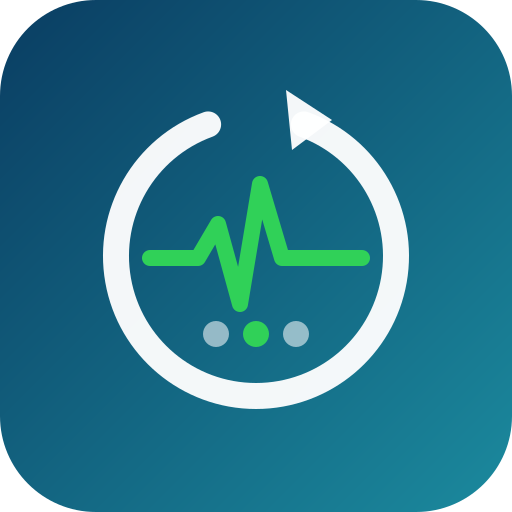
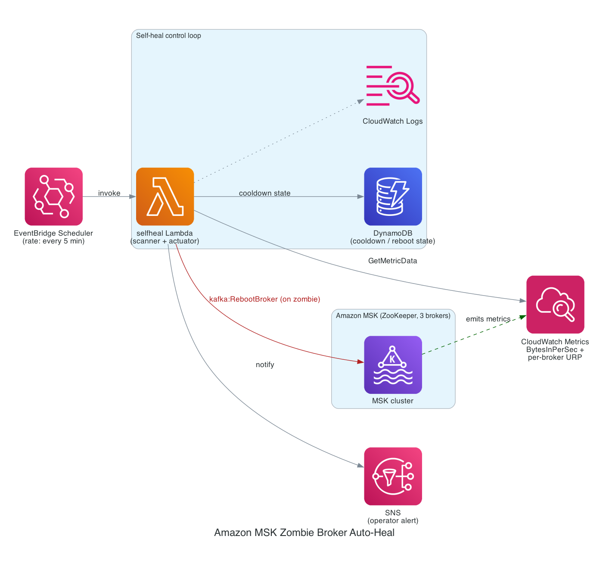

<p align="center">
  
</p>

# msk-zombie-broker-autoheal

**[← English](README.md) · 中文说明**

> **一条命令,自动发现并恢复 Amazon MSK(ZooKeeper 模式)上的"僵尸 broker"。**
> 补上 app-log 卷的监控盲区——别让单个卡死的 broker 演变成长达数小时、且**看不见**的停摆。

[](https://github.com/aws-samples/sample-msk-zombie-broker-autoheal/actions/workflows/ci.yml) []() [](docs/POC-REPORT.md) []() []()

> **已在真实托管 Amazon MSK 集群上端到端验证**(Kafka 3.8.x,ZooKeeper,3 broker):部署+幂等、零误报、在真实 CloudWatch 指标上检测、**自主调用真实 `kafka:RebootBroker`**、真实恢复、cooldown 护栏——见 [`docs/POC-REPORT.md`](docs/POC-REPORT.md)。这次真机 POC 还顺带抓出并修复了两个会让检测"静默失效"的 bug。

> ⚠️ **免责声明**:本项目为示范/参考代码。它会对你的集群调用 `kafka:RebootBroker`——请先审阅 IAM 策略与逻辑、先用 `--observe-only` 模式、并在非生产环境验证后再用于生产。使用风险自负。

---

## 目录

- [60 秒讲清整件事](#60-秒讲清整件事大白话)
- [故障机理（技术版）](#故障机理技术版)
- [快速开始](#快速开始)
- [它是怎么工作的](#它是怎么工作的)
- [它会创建什么](#它会创建什么)
- [IaC 备选（AWS SAM）](#iac-备选aws-sam)
- [L0 — 客户端加固](#l0--客户端加固也请做零迁移)
- [中期根治](#中期根治)
- [局限与诚实声明](#局限与诚实声明)
- [测试](#测试)
- [仓库结构](#仓库结构)
- [安全](#安全)
- [License](#license)

## 60 秒讲清整件事(大白话)

- **到底哪里坏了。** 偶尔某个 MSK broker 的**日志盘**会卡死。可它看上去依然"健康"——进程在、9092 端口开着、ZooKeeper 会话还活着——所以所有健康检查都是绿的。但它其实已经悄悄不干活了,变成了**僵尸**。AWS 的托管监控不看这块盘,ZooKeeper 又因为会话还在而不肯把它踢出去,于是这个故障**看不见、也不会自己好**——能拖上好几个小时。

- **我们怎么发现它。** 我们**不再相信**"它还活着吗"这类检查(在这个场景里它们全是盲的),而是去看 AWS 确实会上报的**症状**:某个 broker **进流量为 0**,同时集群**有分区欠副本**。这两个一起出现 = 这个 broker 是僵尸,哪怕它看着很健康。

- **我们怎么修它。** 对这个 broker 调**一个** AWS API——`RebootBroker`。重启会**掐断它的 ZooKeeper 会话**,而这正是之前缺的一步:这下 Kafka 终于会 fence 掉它、从健康副本里重新选出 leader。服务恢复。

- **本质就这么简单。** 一个很小的 Lambda 每分钟跑一次,找有没有僵尸,有就(在常识性护栏内)把它重启掉。**纯客户侧、零集群迁移、一条命令部署。**

> 一句话精髓:**靠症状认出卡住的 broker,然后把它重启。** 这个仓库里其余所有东西,只是把这件事做得**安全、自动、且有据可查**。

---

## 故障机理(技术版)

在 **ZooKeeper 模式** 下,broker 是否"存活"只由它的 ZooKeeper 会话判定,而该会话的心跳走的是内存+网络,**不依赖磁盘**。当这个 broker 的 **application-log EBS 卷**卡死时,Kafka 的同步日志写会阻塞所有请求处理线程。broker 就成了**僵尸**:进程 `active`、端口 `9092` `LISTENING`、ZK 会话还活着——但它**什么都不服务**。因为 ZK 会话还在,controller **既不 fence、也不重选 leader**。更糟的是,AWS 托管监控/自愈只看 *data* 卷、**丢弃 app-log 卷指标**,所以**不报警、也不自动恢复**。结果就是一个能持续数小时、而所有大屏依然全绿的**部分停摆**。

本工具把丢失的两件事还给你:**检测**(补 AWS 盲区)和**恢复**(绕过 ZK 不 fence)——纯客户侧,无需任何集群迁移。


---

## 快速开始

```bash
git clone https://github.com/aws-samples/sample-msk-zombie-broker-autoheal.git
cd sample-msk-zombie-broker-autoheal

# 1) 先看它会创建什么——不对 AWS 做任何改动：
./deploy.sh --cluster-arn <你的 MSK 集群 ARN> --plan

# 2) 以「只观察」模式部署（只检测+邮件告警，绝不重启）：
./deploy.sh --cluster-arn <ARN> --observe-only --notify-email you@example.com

# 3) 观察几天，看它怎么扫描：
aws logs tail /aws/lambda/msk-autoheal-fn --follow

# 4) 有信心了？去掉 --observe-only 即开启自动恢复：
./deploy.sh --cluster-arn <ARN> --notify-email you@example.com

# 一键拆除它创建的一切：
./deploy.sh --cluster-arn <ARN> --teardown
```

region、集群名、账号、broker 数全部从 ARN 自动解析——没别的要配。部署是**幂等的**,重复跑就是原地更新。

---

## 它是怎么工作的


> 这套闭环在真实集群上逐步执行的**时序图**见 [`docs/POC-REPORT.md`](docs/POC-REPORT.md#the-validated-self-heal-loop-sequence)。

一条 **EventBridge `rate(1 minute)` 定时规则**驱动**一个 Lambda** 扫描每个 broker。没有"每 broker 一条告警"、也没有按 broker-id 路由——增减 broker 零改动(函数从 `DescribeCluster` 读 `NumberOfBrokerNodes`)。

**检测**(已验证的症状信号——朴素的 进程/端口/ZK 检查在这里全盲):

```
僵尸(broker) ⟺  该 broker 的 BytesInPerSec == 0  持续 DETECT_WINDOW_MIN 分钟
                 且  集群存在 UnderReplicatedPartitions > 0
```

（`UnderReplicatedPartitions > 0` 用来区分"卡死"的 broker 和单纯"空闲"的 broker。）**真机关键发现**:MSK 的 `UnderReplicatedPartitions` **只按 per-broker 维度（`[Cluster Name, Broker ID]`）上报、没有"仅 Cluster"维度**;而且**下线/僵尸的 broker 不上报自己的 URP,是 leader broker 上报的**。所以本工具**逐 broker 查询 URP 再聚合**(任一 broker `URP>0` 即判集群欠副本),否则用"仅 Cluster"维度永远查不到、就永远检测不到僵尸。详见 [`docs/POC-REPORT.md`](docs/POC-REPORT.md)。

**恢复**:对那个被确认的僵尸调 `kafka:RebootBroker`。重启掐断它的 ZK 会话,controller 这才 fence 掉它、从健康副本重选 leader。

### 护栏(始终开启)

| 护栏 | 行为 |
|---|---|
| **一次只动一个 broker** | 若**同时**有 2+ 个 broker 像僵尸 → 疑似 AZ/区域级事件(LSE)→ **不自动处理**,发 SNS 叫人。 |
| **冷却(`--cooldown`,默认 600s)** | 同一个 broker 在冷却期内不会被再次重启,给它恢复时间。 |
| **重启无效即升级** | 若重启 + 冷却后该 broker 仍是僵尸 → 判定硬件级卷故障 → **升级**(开 Sev-2 请求 ReplaceNode),不再死循环。 |
| **每日上限(`--daily-cap`,默认 4)** | 超过上限 → 升级给人,而不是无休止重启。 |
| **只观察(`--observe-only`)** | 只检测+告警,绝不重启。建议头几天用它。 |

护栏逻辑由 **15 个离线单元/回归测试**覆盖(`python3 -m unittest discover -s tests`)。

---

## 它会创建什么




| 资源 | 名称(默认前缀 `msk-autoheal`) | 用途 |
|---|---|---|
| Lambda | `msk-autoheal-fn` | 扫描/自愈函数(`selfheal_lambda.py`,python3.12) |
| EventBridge 规则 | `msk-autoheal-schedule` | `rate(1 minute)` 触发 |
| DynamoDB 表 | `msk-autoheal-state` | 每 broker 的冷却/日上限/升级状态(按量计费,14 天 TTL) |
| SNS 主题 | `msk-autoheal-alerts` | 通知(可选邮件订阅) |
| IAM 角色 | `msk-autoheal-role` | 最小权限(见下) |

同时会在集群上(幂等地)开启 **PER_BROKER 增强监控 + Open Monitoring**,以便有 per-broker 的 `BytesInPerSec` 指标。

### 最小权限 IAM

```
kafka:DescribeCluster, kafka:RebootBroker   → 仅限你的那个集群 ARN
cloudwatch:GetMetricData                    → 读指标
dynamodb:GetItem, PutItem                   → 仅限状态表
sns:Publish                                 → 仅限告警主题
logs:* (group/stream/put)                   → Lambda 日志
```

### 成本

基本可忽略:一个 256MB Lambda 每分钟一次(约 4.3 万次/月,多数账号在免费额度内)、每分钟一次 `GetMetricData`、按量计费且流量极小的 DynamoDB、一个 SNS 主题。通常**每月几美元以内**。

---

## IaC 备选(AWS SAM)

偏好声明式基础设施的团队可用 `template.yaml`(与 deploy.sh 等价的 SAM 模板,已通过 cfn-lint):

```bash
sam build && sam deploy --guided \
  --parameter-overrides ClusterArn=<ARN> ClusterName=<NAME> DryRun=true NotifyEmail=you@example.com
```

---

## L0 — 客户端加固(也请做;零迁移)

检测 + 自动重启缩短的是**时长**。**L0 缩小的是爆炸半径**,让单个僵尸 broker 没法连累健康分区:

- `l0-client-hardening/producer.properties` —— `buffer.memory≥64MB`、有界 `retries` + `delivery.timeout.ms`、`acks=all`、幂等。
- `l0-client-hardening/audit-topics.sh` —— 只读审计,标记任何 `RF<3` 或 `min.insync.replicas<2`(即扛不住单 broker 丢失)的 topic。

---

## 中期根治

迁移到 **Kafka 3.7+/4.0 KRaft** 能修掉*判活*缺陷(controller 用 broker 主动心跳判活,独立于磁盘 → 秒级 fence+选举)。但 **KRaft 修不了监控盲区**,所以无论是否迁移,本工具的检测都该继续跑。

---

## 局限与诚实声明

- 托管 MSK **不暴露** app-log 盘的块级 I/O(AWS 盲区延伸进了 Open Monitoring),所以检测用的是**症状**指标(BytesIn=0 + URP>0),而非直接看卡死。这是已验证、可靠的信号。
- `BytesIn=0 + URP>0` 这条启发式把集群级 URP 归因到那个 0 流量的 broker;"一次只动一个 broker"的护栏让它保持保守。
- 这是针对一个已知 AWS 侧盲区的 **workaround**。与此同时,也应推动 AWS 让托管监控覆盖 app-log 卷。

---

## 测试

```bash
# 离线(无需 AWS):15 个单元 + 回归测试
python3 -m unittest discover -s tests -p 'test_*.py'
bash tests/test_arn_parse.sh

# 真机端到端(会真建一套 MSK 集群,约 35 分钟,跑完自动全拆):
bash tests/e2e_live.sh --profile <aws_profile> --region us-east-1
```

---

## 仓库结构

```
selfheal_lambda.py              # Lambda（检测 + 带护栏的自愈）
deploy.sh                       # 一键部署器（--plan/--observe-only/--teardown）
lib/parse_msk_arn.sh            # ARN 解析器（单一事实源）
template.yaml                   # AWS SAM 备选（cfn-lint 通过）
tests/test_guardrails.py        # 9 个离线护栏测试（无需 AWS/boto3）
tests/test_regression.py        # 6 个回归测试（锁死真机发现的 bug）
tests/test_arn_parse.sh         # ARN 解析测试
tests/e2e_live.sh               # 自动化真机 E2E（建→部署→注入→断言→拆除）
.github/workflows/ci.yml        # CI：每次 push 跑测试 + bash -n + cfn-lint
l0-client-hardening/            # producer.properties + audit-topics.sh
docs/ARCHITECTURE.md            # 机理与设计说明
docs/POC-REPORT.md              # 真机验证的证据
docs/img/                       # 架构/流程图（SVG 源 + PNG）
CHANGELOG.md
```

## 安全

安全问题上报方式见 [CONTRIBUTING](CONTRIBUTING.md#security-issue-notifications)。本工具只授予 Lambda 最小权限(对单个集群调 `kafka:DescribeCluster` / `kafka:RebootBroker`、读 CloudWatch 指标、读写自己的小状态表)——部署前请审阅 `deploy.sh` / `template.yaml` 里的 IAM 策略。`RebootBroker` 会重启 broker,请务必先用 `--observe-only` 并保持护栏开启。

## License

本项目采用 MIT-0 License,见 [LICENSE](LICENSE) 文件。

> MIT-0 是 MIT 的"无需署名"变体。你可以自由使用、修改、再分发本代码(含商业用途),无任何附带义务。AWS Sample 项目用此许可以降低采用门槛。
