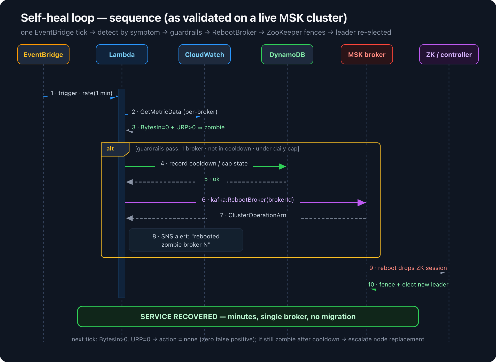

# Architecture & design notes

## The three layers of the failure

| Layer | Defect | Effect |
|---|---|---|
| **A** | Managed monitoring/auto-heal evaluates the **data** volume only and discards **app-log** volume metrics. | The stall raises **no alarm** and triggers **no auto-heal** — the fault is *invisible*. |
| **B** | Broker liveness is judged solely by the **ZooKeeper session**, whose heartbeat is memory + network, **not disk**. | A disk-blocked process keeps its session alive → the controller **never fences it, never re-elects** — the fault **won't self-heal**. |
| **C** | Client defaults: small `buffer.memory`, low `retries`, `acks=1`. | One stuck partition fills the producer buffer → healthy partitions can't write either — the fault **spreads cluster-wide**. |

This tool addresses **A** (detection) and **B** (recovery). The `l0-client-hardening/`
assets address **C** (blast radius).

## Why poll-based (one Lambda) instead of per-broker alarms

A naive design wires one CloudWatch composite alarm per broker
(`BytesInPerSec=0 AND URP>0`) and routes the broker id through EventBridge to a
healer. That is **O(N)** resources and breaks when you scale brokers.

Instead, a single `rate(1 minute)` schedule drives **one** Lambda that:

1. reads `NumberOfBrokerNodes` from `DescribeCluster` (broker ids are `1..N`),
2. issues **one** `GetMetricData` call for all brokers' `BytesInPerSec` + cluster `URP`,
3. classifies zombies, applies guardrails, and reboots at most one broker.

Result: **O(1)** moving parts, broker-count-agnostic, all guardrail state in one place.

## Detection signal — why these metrics

Naive liveness is blind during a stall:

| Signal | Healthy | Stalled (zombie) | Useful? |
|---|---|---|---|
| `systemctl is-active` | active | active | ✗ blind |
| TCP `:9092` | LISTENING | LISTENING | ✗ blind |
| ZK `/brokers/ids` | registered | still registered | ✗ blind |
| **per-broker `BytesInPerSec`** | > 0 | **0** | ✓ |
| **cluster `UnderReplicatedPartitions`** | 0 | **> 0** | ✓ |

On a Prometheus/Open-Monitoring setup the cleanest signal is the broker's scrape
target going `up == 0` (the JMX/Prometheus endpoint itself dies when all JVM threads
block on the synchronous log appender). This tool uses the CloudWatch equivalent so it
needs no extra Prometheus infrastructure.

## Recovery — why `RebootBroker`

`kafka:RebootBroker` is the only client-available action that forces the zombie's ZK
session to drop. Once it drops, the controller fences the broker and elects a new leader
from an in-sync replica — exactly what should have happened automatically. If a reboot
does **not** restore the broker, the volume is failed at the hardware level and only AWS
can `ReplaceNode`; the tool escalates (L3) rather than rebooting in a loop.

## State machine (per broker)



```
healthy ──(BytesIn=0 & URP>0)──▶ zombie
zombie  ──(guardrails pass)────▶ reboot ──▶ cooldown ──┬─(recovered)─▶ healthy (reset)
                                                       └─(still zombie)─▶ escalate ReplaceNode (stop)
2+ zombies at once ─────────────▶ escalate LSE (page human, no auto-action)
reboots_today >= cap ───────────▶ escalate (no auto-action)
```
